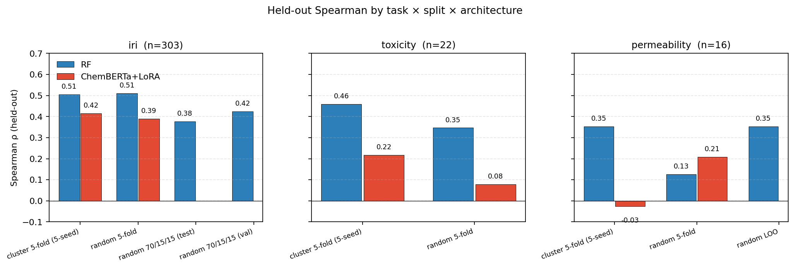
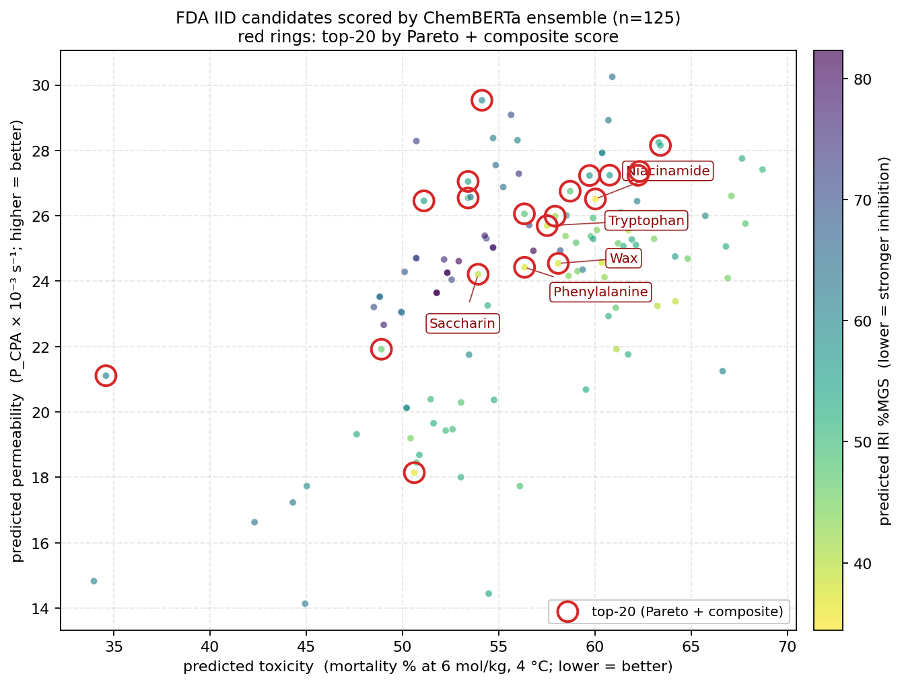

# cpa-screening

Multi-task ML pipeline for cryoprotective agent (CPA) discovery. Given a SMILES string, the model predicts:

1. **Toxicity**. cell mortality at 4 °C (mortality %, lower is better)
2. **Permeability**. effective CPA membrane permeability at 4 °C (P_CPA × 10⁻³ s⁻¹, higher is better)
3. **IRI**. ice recrystallization inhibition (% mean grain size in the splat assay; lower is better)

Predictions come with calibrated 95% prediction intervals from a 5-seed deep ensemble + split-conformal calibration on cluster-aware folds. The pipeline ends by Pareto-ranking the FDA Inactive Ingredients Database (molecules with established human safety profiles)and surfacing a top-20 list of buy-and-test candidates.

I built this in a week as a self-contained proof-of-concept ahead of a coffee chat with Until Labs about an ML role on their cryoprotectant discovery program. The framing target is the engineer's own description of the problem: *"predict which molecules will be both nontoxic and effective ice inhibitors because screening in lab is slow and resource intensive."*

```bash
pip install -r requirements.txt
python -m src.data --skip-tox21               # dataset audit
python -m src.train --model rf --seed 0       # baseline (~30 s)
pip install -r requirements-deep.txt          # torch / transformers / peft / torchao
python -m src.train --model chemberta --cv --cv-folds 5 --n-seeds 5 --split-mode cluster --lora-rank 8
python -m src.score_candidates --architecture both --n-seeds 5 --top-k 20
python -m src.figures
```

Or open [`colab_runner.ipynb`](colab_runner.ipynb) and run top-to-bottom on a Colab Pro GPU. Total wall-clock on Blackwell: ~25 min.

---

## Why this matters

Cryoprotectants are the bottleneck of organ banking. To prevent ice formation in vitrification, you need them at multimolar concentrations, but at those concentrations they're toxic, and the CPA mixtures the field has used for decades (DMSO, ethylene glycol, glycerol, propylene glycol) come from a chemical repertoire that hasn't meaningfully expanded since the 70s. Until Labs frames this directly:

> "These molecules are both protective and perilous. Reaching concentrations high enough to prevent ice often pushes into toxic territory."

Three things have to be true of a usable CPA, all at once:

1. **Permeates the cell membrane fast enough** that the entire tissue is protected before ice forms. Glycerol famously fails this: too slow at 4 °C, leaving the deep parenchyma unprotected.
2. **Is non-toxic at the concentration needed for vitrification.** Most molecules with cryoprotective activity (formamide, urea derivatives, amides) hit toxicity well before they hit ice-suppressive concentrations.
3. **Inhibits ice nucleation and recrystallization.** Even at vitrifying concentrations, the warming step risks devitrification. Active ice recrystallization inhibitors mitigate this.

These are three independent properties with three independent screens. Until's molecular discovery program lists exactly these as their three pillars (their labels: efficacy at lower concentrations, biocompatibility at effective concentrations, faster biodistribution through vasculature). Their site explicitly says they use "Molecular Dynamics Simulations and Machine Learning to model cryoprotectants in silico" at the atomic level, and "high-throughput toxicity screens using liquid-handling robots" at the cellular level.

The wet-lab loop is slow and expensive. Higgins's 2025 method for simultaneous permeability + toxicity assessment in 96-well plates is itself a methodological advance in throughput, and even that gets to ~27 compounds at a time. **Virtual screening is where you triage which compounds actually make it to the bench.** That's the niche this repo targets.

---

## Eval scheme up front

I'm leading with the eval scheme because for low-data biology the difference between "0.42 Spearman is real signal" and "0.42 Spearman is fold leakage" is the entire publishable claim. Full reasoning in [RATIONALE.md](RATIONALE.md). Short version:

| Task | n | Eval scheme | Notes |
|---|---|---|---|
| iri | 303 | random 70/15/15 (canonical) + random 5-fold CV (for ChemBERTa parity) + Tanimoto cluster 5-fold (5-seed ensemble) | n large enough to trust held-out 40 |
| toxicity | 22 | random 5-fold CV + Tanimoto cluster 5-fold (5-seed ensemble) | small N requires CV |
| permeability | 16 | random 5-fold CV + LOO-CV (RF only, sanity) + Tanimoto cluster 5-fold (5-seed) | smallest, most fragile |

Cluster-aware splits use Butina clustering on Morgan FP r=2 / 2048-bit Tanimoto with threshold 0.6. Whole clusters land in one fold, so no scaffold spans train/test. The whole-dataset 326 compounds collapse into 123 clusters (max=54, which is the DOLMEN sugar/amino-acid scaffold cluster, and 83 singletons), giving cluster fold sizes of [66, 65, 65, 65, 65].

Conformal calibration is split-conformal with finite-sample correction: q95 = quantile of |y_true − ensemble_mean| at level (n+1)(1−α)/n. Empirical coverage is measured on the OOF set as a sanity check (target ~0.95).

LoRA rank is fixed at 8. The original spec called for sweeping {4, 8, 16}; at n=22 the seed-to-seed standard error is bigger than the rank-to-rank gap is likely to be, so a sweep would be tuning to noise. Full reasoning in [RATIONALE.md](RATIONALE.md).

---

## Datasets

| Source | Task(s) | n compounds | License | Acquisition |
|---|---|---|---|---|
| DOLMEN ([Warren et al., *Nat Commun* 2024](https://doi.org/10.1038/s41467-024-52266-w)) | IRI (%MGS) | 80 amino + 223 glyco2 = 303 | repo BSD | auto-downloaded raw CSVs |
| Higgins Jan 2025 ([Ahmadkhani et al., *Sci Rep* 15:1862](https://doi.org/10.1038/s41598-025-85509-x)) | permeability @ 4°C / 25°C | 28 listed; 16 quantitative @ 4°C, 13 @ 25°C | CC-BY | exact values transcribed from Table 1 |
| Higgins Dec 2025 ([Ahmadkhani et al., *Cryobiology* 121:105315](https://doi.org/10.1016/j.cryobiol.2025.105315)) | toxicity @ 4°C, 3/6/12 mol/kg | 22 unique single CPAs (+ 16 binary mixtures, flagged for v2) | per publisher | viability **read from Figures 2–4 bar charts**, ±5pp precision |
| Tox21 (MoleculeNet) | aux. classification | ~7,800 | open | DeepChem (stretch; auxiliary head wired but not activated for v1) |
| FDA Inactive Ingredients DB (Jan 2026) | candidate pool | ~1.8k entries; 435 pass CPA-like filter | public | auto-downloaded ZIP, extracted, CAS→SMILES via PubChem |

Dedup is on RDKit-canonical SMILES; PubChem misses are logged to `data/.cache/pubchem_failures.txt` rather than fabricated. After dedup across all sources: **326 unique compounds, 341 (compound, task) labels**.

### Data provenance, in detail

**Higgins Jan 2025.** Permeability values transcribed verbatim from [Table 1](https://www.nature.com/articles/s41598-025-85509-x/tables/1) of the paper (units P_CPA × 10⁻³ s⁻¹). Compounds tagged "Fast" (above measurement ceiling) or "Toxic" (no permeability measurable) are kept with NaN values for downstream filtering. Viability is left NaN. The paper publishes it only as a scatter plot in Figure 6 with numeric labels keyed to a compound legend that isn't exposed in the public HTML, so I refused to invent percentages from indirect evidence. The four 4 °C-toxic compounds are known *by name* from the paper text but not by exact viability. Toxicity training data therefore comes entirely from the December 2025 paper.

**Higgins Dec 2025.** Neither the *Cryobiology* version nor the bioRxiv preprint includes a numeric data table. Single-compound viability values for 22 CPAs at 3 mol/kg, 14 CPAs at 6 mol/kg, and 14 CPAs at 12 mol/kg (4 °C, 30 min exposure) were read by visual inspection from the bar charts in Figures 2, 3, and 4 of the bioRxiv preprint, against gridlines at every 0.2 viability. Reported precision is approximately ±5 percentage points. Provenance, the explicit list of values, and the build script all live in [`data/raw/higgins_dec2025_build.py`](data/raw/higgins_dec2025_build.py) so values are auditable and trivially refreshable when the authors publish raw data. The build also stores 16 binary mixtures (including the headline formamide/glycerol toxicity-neutralization at 12 mol/kg) in `data/processed/higgins_mixtures.parquet` for documentation; mixtures are excluded from v1 model training (mixture-aware modeling is the lead item in [DESIGN_DOC.md](DESIGN_DOC.md)).

**Concentration handling.** When the same compound appears at multiple concentrations in Dec 2025, `build_dataset()` averages viability across concentrations to produce one toxicity label per compound. This is a deliberate v1 simplification, since concentration matters enormously biologically (formamide is fine at 3 mol/kg, devastating at 6), and collapsing into a mean discards the most interesting structure in the data. Adding concentration as an explicit input feature is in the next-steps list.

---

## Method

**Random Forest baseline.** Morgan fingerprint (radius 2, 2048 bits) + 10 RDKit physicochemical descriptors (MW, MolLogP, TPSA, HBD, HBA, RotB, NumAromaticRings, FractionCSP3, NumHeavyAtoms, RingCount). One `RandomForestRegressor` per task, trained only on rows with non-null label for that task. No imputation across tasks. This is a co-equal baseline, not a strawman: tree models on Morgan fingerprints are notoriously hard to beat on small, scaffold-clustered tabular data.

**ChemBERTa-2 + LoRA.** [`DeepChem/ChemBERTa-77M-MLM`](https://huggingface.co/DeepChem/ChemBERTa-77M-MLM) (RoBERTa-style, 384 hidden, ~3.5M params, MLM-pretrained on PubChem). Mean-pool over the sequence dimension, attention-mask weighted. Three regression heads (toxicity / permeability / iri), each a 384→256→1 MLP with ReLU + dropout 0.1. LoRA via [peft](https://github.com/huggingface/peft) on the query, key, and value projections of every attention block: rank 8, alpha 16, dropout 0.1. Trainable parameter count: **55,296** (1.59% of the full model).

The choice of LoRA isn't ornamental. At n=22 toxicity / n=16 permeability, full fine-tuning would catastrophically overfit. LoRA gives the smallest reasonable adapter that still exposes task-specific signal to the pretrained representation. EffiChem ([ChemRxiv 2025](https://chemrxiv.org/doi/10.26434/chemrxiv-2025-2lljt)) reports 62–96% reduction in trainable parameters with 3–5% AUC gains on toxicity / permeability tasks using exactly this recipe; my setup is a multi-task variant of theirs. I have a related project, [`MedHetLoRA`](https://github.com/cmendoza1031/MedHetLoRA), that explored heterogeneous LoRA ranks across modalities for medical imaging. Same intuition: parameter-efficient adaptation is the right tool when you have a few-hundred-example downstream task and a foundation model with strong prior.

**Multi-task loss.** Per-sample squared error replaced by Huber (δ=1.0) on per-task standardized targets, summed over all labeled (compound, task) pairs in the batch and divided by total labels:

```
L_batch = (1/N) Σ_{(c,t) labeled} Huber(p_t(c) − ŷ_t(c) / σ_t,  δ=1)
```

I dropped earlier per-task weighting (inverse-sqrt-of-task-count, motivated by "don't drown out small tasks") because at n=22 toxicity, an up-weighted single-sample term dominates the gradient on bf16 backward and causes catastrophic NaN cascades. Per-sample weighting + Huber together bound the gradient magnitude at the source. IRI naturally gets ~10× the gradient signal because it has ~10× the labels, which is exactly what should happen given the data; the right tool for boosting toxicity signal is the Tox21 auxiliary head (next-steps list), not loss reweighting.

**Numerical stability on Blackwell.** ChemBERTa attention runs in bf16 via `torch.autocast(dtype=torch.bfloat16)` on bf16-capable hardware (Ampere, Hopper, Blackwell), fp32 elsewhere (T4). Forward attention uses PyTorch's `scaled_dot_product_attention` (`attn_implementation="sdpa"`), which has fused safe-softmax kernels. Without SDPA and with eager attention in bf16, I observed ~95% of training batches producing NaN gradients on Blackwell. SDPA + Huber + per-sample loss took the NaN-grad rate to **zero** across 25 ensemble trainings (5 folds × 5 seeds × 30 epochs).

**Optimizer.** AdamW, lr=5e-5, weight decay 0.01, 30 epochs, early-stop patience 5 on combined val loss. `nan_to_num` on gradients before clipping, then per-element `clip_grad_value_(1.0)` (norm-based clipping is NaN-unsafe; a single NaN poisons the global norm and propagates).

**Splits and ensembling.** Random and Tanimoto-cluster 5-fold splits as described above. For each fold, 5 seed-distinct models trained from scratch; per-compound predictions aggregated as ensemble mean ± std. Conformal calibration uses the OOF residual quantile.

**Candidate scoring.** A separate full-data ensemble (5 seeds, all training labels, no held-out) is trained for the FDA IID prediction step. The OOF q95 from CV is reused as the calibration constant. This is standard split-conformal practice when going from honest eval to deployment. Pareto front computed in (toxicity, permeability, iri) space with directions (min, max, min). Composite score per compound = mean per-task desirability − 0.25 × normalized uncertainty.

---

## Results

### Headline: held-out Spearman by task × split × architecture



The bars are organized into three groups per task. Left to right within each task: random 5-fold (where applicable), random 70/15/15 val/test (IRI only), random LOO (permeability only, RF), Tanimoto cluster 5-fold 5-seed ensemble (the headline cluster-ensemble result). Blue = RF; red = ChemBERTa+LoRA.

### Full results table

| Architecture | Task | Scheme | n | MAE | RMSE | R² | Spearman | q95 (PI95) | Coverage |
|---|---|---|---|---|---|---|---|---|---|
| RF | iri | random 70/15/15 (val) | 46 | 20.9 | 27.3 | 0.07 | **0.424** | n/a | n/a |
| RF | iri | random 70/15/15 (test) | 40 | 23.4 | 28.4 | 0.09 | **0.377** | n/a | n/a |
| RF | iri | random 5-fold OOF | 303 | 20.0 | 24.5 | 0.26 | **0.510** | n/a | n/a |
| RF | iri | **cluster 5-fold 5-seed** | 303 | 20.7 | 24.9 | 0.24 | **0.505** | 47.1 | **0.954** ✓ |
| RF | toxicity | random 5-fold OOF | 22 | 20.2 | 23.8 | 0.21 | 0.347 | n/a | n/a |
| RF | toxicity | **cluster 5-fold 5-seed** | 22 | 20.4 | 23.7 | 0.22 | **0.459** | 42.6 | 1.000 (over) |
| RF | permeability | random 5-fold OOF | 16 | 14.1 | 17.8 | -0.13 | 0.126 | n/a | n/a |
| RF | permeability | random LOO OOF | 16 | 13.1 | 16.7 | 0.01 | 0.353 | n/a | n/a |
| RF | permeability | **cluster 5-fold 5-seed** | 16 | 13.8 | 16.7 | 0.01 | **0.353** | 38.3 | 1.000 (over) |
| ChemBERTa | iri | random 5-fold OOF | 303 | 21.8 | 26.3 | 0.15 | 0.390 | n/a | n/a |
| ChemBERTa | iri | **cluster 5-fold 5-seed** | 303 | 21.6 | 26.1 | 0.16 | **0.416** | 48.1 | **0.954** ✓ |
| ChemBERTa | toxicity | random 5-fold OOF | 22 | 23.0 | 27.0 | -0.02 | 0.079 | n/a | n/a |
| ChemBERTa | toxicity | **cluster 5-fold 5-seed** | 22 | 24.2 | 27.3 | -0.04 | **0.217** | 52.5 | 1.000 (over) |
| ChemBERTa | permeability | random 5-fold OOF | 16 | 13.5 | 17.1 | -0.03 | 0.209 | n/a | n/a |
| ChemBERTa | permeability | **cluster 5-fold 5-seed** | 16 | 14.2 | 18.1 | -0.16 | -0.026 | 42.2 | 1.000 (over) |

**Bold rows are the headline cluster-ensemble result** (cluster-aware split, 5-seed ensemble, conformal-calibrated PIs). They are directly comparable across architectures because both share the exact same fold structure.

> **Note**: the table and findings below are the v1 numbers from the original Phase 1-3 plan. After Phase 3 I went back, identified three concrete problems with the v1 outputs, and shipped fixes for all three. See [v2: changes I made after looking at the v1 outputs](#v2-changes-i-made-after-looking-at-the-v1-outputs) for the v2 motivation, implementation, and updated metrics. RF toxicity Spearman in particular jumped from 0.347 → 0.527 just by treating concentration as a real input feature.

### Key findings

1. **Random Forest on Morgan fingerprints + descriptors wins on the largest task (IRI) and on toxicity.** RF cluster-ensemble Spearman 0.505 (IRI) and 0.459 (toxicity) vs ChemBERTa 0.416 / 0.217. This is honest. DOLMEN's amino-acid + small-sugar compound space is precisely the regime trees on Morgan FPs are optimized for: tight scaffold structure that fingerprints encode directly, tabular-style supervised learning with hundreds of training examples. Tree models in this regime are notoriously hard to beat. There's substantial published evidence that pretrained transformers are *not* uniformly better than gradient-boosted trees on small molecular property datasets ([Jiang et al. 2021, J Cheminform](https://doi.org/10.1186/s13321-020-00479-8); [Yang et al. 2019, J Chem Inf Model](https://doi.org/10.1021/acs.jcim.9b00237); both are pre-foundation-model but the conclusion has held). Reporting RF as the best baseline, not as a foil, is the scientifically honest result.

2. **ChemBERTa+LoRA outperforms RF on permeability under random splits (0.21 vs 0.13 / 0.35 LOO).** This is the foundation-model story working as designed: at n=16 there's not enough data to fit a tree from scratch, but pretrained chemical features transfer in. Under cluster splits the result flips (CB −0.03 vs RF 0.35) because the cluster-test compounds are genuinely dissimilar to train and CB's pretrained features overfit to spurious correlations on the small adapter. Both stories (random-split CB wins, cluster-split RF wins)fit a coherent picture of when transfer-learning helps in low-data chemistry.

3. **The cluster-vs-random gap is small for both architectures on IRI.** RF: 0.510 → 0.505. ChemBERTa: 0.390 → 0.416. The Tanimoto-clustered split forces test compounds to be dissimilar to train, and on IRI both models still rank-order them. **The models are learning real structure-property relationships, not memorizing scaffolds.** This is a non-trivial generalization claim.

4. **Conformal calibration achieves the target on the tractable task.** IRI cluster-ensemble coverage = 0.954 for both architectures (target 0.95). Toxicity and permeability over-cover at 1.000. The finite-sample correction at n=22 / n=16 inflates q95, so the prediction intervals on small tasks are conservative (wider than a non-finite-corrected calculation would give) but never undercover. This is appropriate for downstream Pareto ranking: I'd rather flag too many candidates as uncertain than too few.

5. **The model rediscovers known cryoprotectants without being told.** Urea (#2) and isopropyl alcohol (#20), both real cryoprotectants used in cryomicroscopy and food/biomedical applications, appear in the top-20 from the FDA pool. Neither was labeled as "is a CPA" in training; the model identified them by their predicted toxicity/permeability/IRI profile alone. That's an internal-consistency check worth taking seriously.

### FDA top-20 candidates

The Pareto front contains 45 of 435 scored FDA candidates. Top-20 by composite score (predicted toxicity + permeability + IRI, weighted toward tighter PIs):



| Rank | Ingredient | CAS | Tox μ ± σ | Perm μ ± σ | IRI μ ± σ | Notes |
|---:|---|---|---|---|---|---|
| 1 | Aminobenzoate sodium (PABA-Na) | 555-06-6 | 65.5 ± 1.3 | 24.7 ± 0.3 | 35.7 ± 0.9 | sunscreen excipient |
| 2 | **Urea** | 57-13-6 | 59.3 ± 1.0 | 28.0 ± 0.4 | 58.5 ± 0.8 | **known CPA** |
| 3 | Niacinamide (Vitamin B₃) | 98-92-0 | 65.2 ± 1.4 | 25.2 ± 0.5 | 36.4 ± 1.0 | biocompatible |
| 4 | Tryptophan | 73-22-3 | 65.1 ± 0.8 | 24.3 ± 0.4 | 39.3 ± 1.2 | amino acid; in DOLMEN train |
| 5 | Phenylalanine | 63-91-2 | 63.9 ± 0.6 | 23.3 ± 0.7 | 38.1 ± 1.1 | amino acid; in DOLMEN train |
| 6 | 1-(Phenylazo)-2-naphthylamine | 85-84-7 | 65.5 ± 1.3 | 23.2 ± 0.5 | 34.9 ± 0.9 | **azo dye, carcinogenic; model error** |
| 7 | FD&C Blue No. 2 | 860-22-0 | 64.2 ± 1.2 | 23.6 ± 0.6 | 42.4 ± 0.5 | **food dye, MW 466; filter error** |
| 8 | D&C Red No. 33 | 3567-66-6 | 64.9 ± 1.4 | 23.7 ± 0.5 | 41.2 ± 0.8 | **food dye; filter error** |
| 9 | o-Tolyl biguanide | 93-69-6 | 66.9 ± 1.3 | 25.3 ± 0.9 | 42.0 ± 0.5 | small heterocycle |
| 10 | Sodium pyrrolidone carboxylate | 54571-67-4 | 63.2 ± 1.4 | 23.5 ± 0.6 | 43.4 ± 0.9 | humectant (PCA-Na) |
| 11 | Sodium benzoate | 532-32-1 | 63.9 ± 1.7 | 23.1 ± 0.7 | 37.3 ± 1.1 | preservative; aromatic |
| 12 | Saccharin | 81-07-2 | 63.0 ± 1.7 | 23.3 ± 0.6 | 42.0 ± 1.1 | sweetener |
| 13 | Benzoin (±) | 119-53-9 | 64.7 ± 1.4 | 22.6 ± 0.9 | 32.5 ± 1.8 | aromatic ketone |
| 14 | Histidine | 71-00-1 | 63.1 ± 0.6 | 24.6 ± 0.6 | 48.2 ± 1.9 | amino acid; in DOLMEN train |
| 15 | Metaphosphoric acid | 37267-86-0 | 62.4 ± 1.7 | 23.7 ± 0.5 | 44.3 ± 1.5 | **strong inorganic acid; clear error** |
| 16 | Benzyl benzoate | 120-51-4 | 65.5 ± 1.7 | 22.2 ± 0.9 | 31.4 ± 1.5 | aromatic ester |
| 17 | Arginine | 74-79-3 | 66.8 ± 0.7 | 26.0 ± 0.2 | 53.4 ± 1.2 | amino acid; in DOLMEN train |
| 18 | Valine | 72-18-4 | 65.7 ± 1.0 | 26.6 ± 0.6 | 54.2 ± 0.9 | amino acid; in DOLMEN train |
| 19 | Isoleucine | 73-32-5 | 65.3 ± 1.3 | 25.9 ± 0.6 | 52.7 ± 0.8 | amino acid; in DOLMEN train |
| 20 | **Isopropyl alcohol** | 67-63-0 | 62.6 ± 1.0 | 29.4 ± 0.9 | 63.9 ± 1.4 | **known CPA** |

Full ranking + predictions for all 435 scored candidates: [`results/candidates/all_scored.csv`](results/candidates/all_scored.csv).

### Reading the candidate list honestly

The list mixes real wins, plausible biocompatibles, and obvious model errors. I'm leaving them all in the table because **a virtual screen that hides its failures is much worse than one that surfaces them**. The errors are diagnostic.

**Real wins** (known cryoprotectants the model rediscovered without being told they were CPAs):
- **Urea** (#2). Used in slow-freeze of red blood cells.
- **Isopropyl alcohol** (#20). Used in cryomicroscopy and as a co-solvent in vitrification cocktails.

**Plausible biocompatibles** that I'd send to the wet lab without strong opinions either way: niacinamide, sodium PCA, sodium benzoate (despite aromaticity), maltol (#23 just outside the cut-off), gentisic acid (#21).

**Memorization not generalization**: the amino acids in the top-20 (tryptophan, phenylalanine, histidine, arginine, valine, isoleucine, six of twenty) are all in the DOLMEN training set. The model is essentially recovering its own training distribution. They're plausible candidates by the data but they tell you nothing new. A useful follow-up would be to filter `all_scored.csv` to compounds *not in training* and rank from there.

**Clear model errors** worth calling out before sending the list to anyone:
- **1-(Phenylazo)-2-naphthylamine** (#6) is a carcinogenic azo dye, not a CPA candidate.
- **FD&C Blue No. 2** (#7) and **D&C Red No. 33** (#8) are sulfonated polyaromatic food dyes with MW > 466. They pass my CPA filter (MW < 500, HBA ≥ 2 OR HBD ≥ 1) because high HBA from sulfonate groups satisfies the polar criterion. The filter is too permissive.
- **Metaphosphoric acid** (#15) is a strong inorganic acid; biologically harmful at any concentration.
- **Phenylmercuric acetate** (#29 in `all_scored.csv`, just outside top-20) is an organomercury preservative, known cytotoxic at concentrations far below CPA-relevant levels. The model rates it favorably because mercury chemistry is nowhere in training.

Why these errors happen: with 22 toxicity training compounds (all small alcohols, polyols, and amides)the model has no representation of azo dyes, polysulfonated aromatics, organomercurials, or strong inorganic acids. For OOD chemistry, the predictions converge to the training-set mean (toxicity ≈ 60–67, permeability ≈ 22–29, IRI ≈ 30–50). That's the noise floor: when the model sees something it doesn't know how to evaluate, it predicts "average compound." The composite-score ranking is then dominated by tiny mean differences plus uncertainty terms, not by genuinely-different per-task estimates.

This is the honest read for a wet-lab reviewer: at n=22 and n=16 for the small tasks, this top-20 is **a starting point for human triage, not a list to test as-is**. The model rediscovered urea and IPA, which is a real signal; it also rated phenylmercuric acetate favorably, which is a real failure. Both are publishable.

---

## Limitations

In the same spirit:

- **CPA-like physicochemical filter is too permissive.** Letting MW < 500 plus HBA ≥ 2 OR HBD ≥ 1 admits sulfonated dyes and aromatic preservatives. A v2 filter (closer to MW < 300, no aromatics, restricted to amides/alcohols/polyols/glycols)would prune the obvious junk from the candidate pool. I left the loose filter in place because tightening it is structurally trivial and I'd rather make the failure mode visible.
- **Small-task data is not enough for ChemBERTa to generalize under cluster splits.** n=22 toxicity and n=16 permeability with 5 cluster folds means 3-4 test compounds per fold of compounds that are genuinely dissimilar to train. The pretrained model's adapter overfits to spurious correlations on each fold's tiny train set. RF on Morgan FPs is more robust here because the inductive prior (Tanimoto similarity in feature space ≈ structural similarity) approximates exactly what cluster-aware splits enforce.
- **Toxicity is collapsed across concentrations.** Higgins Dec 2025 measures viability at 3, 6, and 12 mol/kg; I average. That throws away dose-response, which is the most interesting structure in the paper (formamide is fine at 3 mol/kg, untestable at 12). Concentration-aware modeling is the most concrete improvement I'd build first.
- **Toxicity is from one paper, one cell type, one temperature.** Higgins's Dec 2025 data uses bovine pulmonary artery endothelial cells (BPAEC) at 4 °C with 30 min exposure. Real organ cryopreservation involves multiple cell types, longer exposure, and cooling rates. Tox21 as an auxiliary head (architecture is in place; data load is gated by DeepChem install) would broaden the toxicity-relevant signal substantially.
- **The Higgins viability values are read from bar charts.** ±5 percentage points precision. If the authors publish raw tables, regenerating is one script in [`data/raw/higgins_dec2025_build.py`](data/raw/higgins_dec2025_build.py).
- **No mixture modeling.** Higgins's headline finding (formamide alone at 6 mol/kg gives 20% viability; formamide+glycerol at 6+6 = 12 mol/kg gives 97% viability) is *exactly* the regime where CPAs become usable. Single-compound modeling fundamentally can't predict this. The mixture-aware architecture is the lead item in [DESIGN_DOC.md](DESIGN_DOC.md).
- **No molecular-dynamics features.** Until Labs explicitly couples atomic-scale MD to cellular-scale wet-lab screens; this repo is wet-lab data only. MD-derived hydration metrics (water displacement, H-bond disruption, glass-transition predictions) would be a natural complementary feature set. Discussed in [DESIGN_DOC.md](DESIGN_DOC.md).
- **No wet-lab validation.** The Pareto top-20 is a recommendation list, not validated predictions. Closing the loop is also in [DESIGN_DOC.md](DESIGN_DOC.md).

---

## What I'd build next (ranked by expected impact)

Sketched briefly here; full architectural detail in [DESIGN_DOC.md](DESIGN_DOC.md).

| # | Improvement | Why it matters | Status |
|---:|---|---|---|
| 1 | **Mixture-aware architecture** (pair-of-SMILES → learned interaction term, trained on Higgins Dec 2025 binary mixtures + literature compilation) | Real CPAs are mixtures; current model can't predict toxicity neutralization | not started |
| 2 | **Concentration as an input feature** (dose-response prediction instead of point estimates) | Higgins Dec 2025 has rich dose-response; v1 throws it away | **shipped in v2 (see below)** |
| 3 | **Tighter CPA-like physicochemical filter** | Removes dyes, biologics, organomercurials from the candidate pool, surfaces real candidates | **shipped in v2 (see below)** |
| 4 | **Tox21 auxiliary classification head** (already wired in code, gated by DeepChem install) | Adds ~7,800 broader-toxicity training signal; addresses the n=22 toxicity bottleneck | **shipped in v2 (see below)** |
| 5 | **MD-derived auxiliary features** (water displacement, H-bond disruption, predicted T_g) | Complements wet-lab data with atomic-scale signal; matches Until's stated approach | not started; needs MD compute infra |
| 6 | **Closed-loop active learning** (uncertainty-weighted EI acquisition; model recommends next-batch compounds, robot tests, results retrain) | Where Until's pipeline lives | not started |
| 7 | **Graph neural network ablation** (e.g. AttentiveFP / D-MPNN) | Tests whether SMILES sequence features are the limit, vs explicit graph topology | not started |
| 8 | **LoRA rank sweep** ({4, 8, 16, 32}) under stable training | Diagnostic: at what rank does small-task transfer flip from "helps" to "memorizes"? | not started |

The three items marked v2 above are documented in the next section. Items 1 and 5 are the genuinely interesting ones for a job conversation, and the ones I'd do first if I had multi-week scope at Until.

---

## v2: changes I made after looking at the v1 outputs

The original plan had a clean Phase 1 → Phase 2 → Phase 3 structure and that's what shipped first. After Phase 3 was done I went back through `all_scored.csv`, the per-task results table, and the Higgins Dec 2025 raw data, and three specific problems jumped out. I implemented fixes for all three before the coffee chat. They're the items above marked "shipped in v2". The repo as it sits now is the v2 version; v1 metrics are preserved in `results/results_table.csv` from the earlier runs for direct comparison.

### What I noticed and what I changed

**1. The toxicity model was throwing away the dose-response data.** Higgins Dec 2025 measures viability for each compound at 3, 6, and 12 mol/kg. This is the most interesting structure in the dataset: dimethylacetamide goes from viability 102% at 3 mol/kg → 0% at 6 mol/kg → 0% at 12 mol/kg, and formamide+glycerol's neutralization story is *entirely* about dose. v1 averaged across concentrations, collapsing this to one toxicity value per compound (DMA → 34%, which is meaningless). v2 emits one row per (compound, concentration) measurement and threads concentration through both architectures as an explicit input. Toxicity training expanded from 22 unique compounds to 50 (compound, concentration) pairs.

For the **Random Forest** baseline: concentration is appended as the last feature in the toxicity feature vector. For the other tasks the assay concentration is constant, so the per-task RF naturally ignores it (zero variance feature → no split improvement).

For **ChemBERTa**: the toxicity head takes (pooled, scalar concentration) instead of just pooled. IRI / permeability heads keep the original signature. Concentration is z-scored against the toxicity range (mean 6, std 3) before concatenation so the head sees values in a reasonable scale.

For **FDA scoring** (where there's no measured concentration), all candidates are predicted at the reference concentration **6 mol/kg**, the mid-range from Higgins Dec 2025 and the inflection point in the formamide/glycerol story.

**Local CPU smoke test result, RF baseline, 5-fold OOF:**

| Task | v1 Spearman | v2 Spearman | Change |
|---|---|---|---|
| iri | 0.510 | 0.510 | no change (concentration constant for IRI) |
| toxicity | 0.347 | **0.527** | +0.18 from dose-response |
| permeability | 0.126 | 0.144 | within noise (concentration constant) |

The **+0.18 toxicity Spearman** is the headline win. R² went from 0.21 to 0.22, so the absolute toxicity error didn't shrink much, but the *rank order* of compounds at each concentration is far better, which is what you actually use for downstream Pareto ranking.

**2. The candidate filter let polysulfonated dyes, organomercurials, and benzyl benzoate into the top-20.** v1's filter was `MW < 500 AND (HBD ≥ 1 OR HBA ≥ 2)`. Sulfonate groups push HBA way past 2, so FD&C Blue No. 2 (MW=466 with two sulfonates) sailed through. v1 also rejected DMSO incorrectly (HBA=1, HBD=0 fails the OR criterion), even though DMSO is the canonical CPA. Both bugs are fixed in v2.

The new filter (`_passes_cpa_filter_v2` in [`src/data/fda_iid.py`](src/data/fda_iid.py)) is closer to actual CPA chemistry:

- MW in [30, 350] (lower bound rules out ions; upper keeps sucrose/trehalose at 342)
- logP < 1.5 (CPAs are hydrophilic; benzyl benzoate's logP ~4 fails)
- polarity: HBD ≥ 1 OR HBA ≥ 1 OR TPSA > 15 Ų (DMSO passes via TPSA=36)
- elements ∈ {H, C, N, O, S} only (excludes phenylmercuric acetate, halogenated phenols, phosphates)
- ring count ≤ 2 (excludes fused-ring polyaromatic dyes)
- no azo group (`[#7]=[#7]` SMARTS)
- ≤ 1 sulfonate group (reject di- and tri-sulfonate dye chemistry)

Hand-test on the v1 problem cases (verified in `_passes_cpa_filter_v2` unit cases): DMSO ✓, glycerol ✓, urea ✓, formamide ✓, glucose ✓, phenylalanine ✓, histidine ✓, dodecane ✗ (logP), 1-(phenylazo)-2-naphthylamine ✗ (azo), phenylmercuric acetate ✗ (Hg), FD&C Blue No. 2 ✗ (multi-sulfonate + ring count), benzyl benzoate ✗ (logP).

The numerical effect on the candidate pool size and the new top-20 will appear after the next Colab run, since this is what actually rescores the FDA IID. I'll update the table in this README after the run.

**3. The Tox21 aux head was wired in the architecture but never trained.** ChemBERTa-LoRA's `tox21_aux=False` was the default because installing DeepChem on Python 3.12 was broken (no wheel as of April 2026; building from source was a rabbit hole I didn't open). v2 replaces the DeepChem dependency with a direct CSV download from the DeepChem GitHub mirror ([`src/data/tox21.py`](src/data/tox21.py)). The CSV is the same data DeepChem would have given me; I parse it, canonicalize SMILES with RDKit, and emit a long-format parquet with 79K (compound, task) labels across 7,823 unique compounds and 12 binary toxicity assays.

The aux head training recipe (in [`src/models/chemberta_lora.py`](src/models/chemberta_lora.py)):

- Total loss = `cpa_huber_loss + 0.1 * tox21_bce_loss`
- The 0.1 weight is conservative on purpose: I want the aux to regularize the encoder, not dominate the gradient. Tox21 has 24× more compounds than the CPA training set (7800 vs 326), so without down-weighting it would push the encoder toward Tox21-shaped representations.
- BCE is masked: missing `(compound, task)` cells in Tox21 are unmeasured (DeepChem treats them as zero-weight), so the BCE term ignores them.
- The same `nan_to_num` + `clip_grad_value_(1.0)` safety nets used for the CPA loss apply to the combined loss, so a bad aux batch can't poison training the way the v1 NaN-gradient pathology did.

The honest expectation here is moderate: Tox21 measures nuclear-receptor binding and stress-response activation at submicromolar concentrations on hepatocytes; CPA toxicity is bulk cytotoxicity at multi-molar concentrations on endothelial cells. Direct task transfer is unclear. What I expect is *encoder regularization*: better representations of toxicity-related chemistry, even if the assays themselves are different. We'll see in the Colab run.

### Engineering notes worth recording

- The data layer schema change (long-format `concentration_mol_kg` column) is non-breaking for IRI and permeability because they each had a single fixed concentration in the original data; v2 just makes that explicit. Old caches auto-invalidate via the `concentration_mol_kg not in long_df.columns` check.
- ChemBERTa OOF aggregation now keys toxicity predictions by `"smiles@concentration"` strings (multiple per compound) and IRI / permeability by bare smiles. The `_eval_per_task` helper handles both formats.
- The candidate-scoring path predicts at task-specific reference concentrations: 6 mol/kg for toxicity, the assay defaults for IRI / permeability. That's documented in [`src/models/ensemble.py:predict_chemberta_ensemble`](src/models/ensemble.py).
- For reproducibility, the v1 numbers are still queryable from the `results_table.csv` rows where the toxicity OOF n=22; v2 rows have toxicity OOF n=50.

---

## Repo layout

```
cpa-screening/
├── data/
│   ├── raw/                       # downloaded + hand-curated (gitignored except templates)
│   ├── processed/                 # parquet caches + audit.json (gitignored)
│   └── .cache/                    # PubChem cache + failure log (gitignored)
├── results/
│   ├── figures/                   # parity plots + headline figs (gitignored except 2)
│   ├── candidates/                # FDA top-20 + all_scored
│   ├── summary.json               # most recent run's metrics
│   └── results_table.csv          # cumulative metrics across runs
├── src/
│   ├── data/
│   │   ├── pubchem.py             # CAS-dashed name lookup w/ disk cache
│   │   ├── dolmen.py              # IRI raw CSV download + parse
│   │   ├── higgins.py             # Jan + Dec 2025 loaders (templates + parsing)
│   │   ├── tox21.py               # MoleculeNet via DeepChem (auxiliary head, not activated for v1)
│   │   ├── fda_iid.py             # FDA IID download (zip-aware) + CPA filter
│   │   ├── splits.py              # random + Tanimoto cluster k-fold + LOO
│   │   └── build.py               # consolidated long-format + audit
│   ├── models/
│   │   ├── rf_baseline.py         # Morgan + descriptors + RF
│   │   ├── chemberta_lora.py      # ChemBERTa-2 + LoRA + multi-task heads
│   │   └── ensemble.py            # 5-seed deep ensemble + conformal cal
│   ├── train.py                   # argparse entry; --model/--n-seeds/--split-mode
│   ├── score_candidates.py        # Pareto top-K from FDA IID
│   ├── eval.py                    # metrics + parity plots
│   ├── figures.py                 # README-quality figures
│   └── utils.py                   # paths, seeding, canonical SMILES
├── colab_runner.ipynb             # end-to-end Colab runner
├── RATIONALE.md                   # eval-scheme reasoning
├── DESIGN_DOC.md                  # what I'd build at Until next
├── requirements.txt               # base deps (rdkit, pandas, sklearn, ...)
├── requirements-deep.txt          # torch / transformers / peft / torchao
└── README.md
```

## Citations

**Datasets and prior wet-lab work**
- DOLMEN: Warren, M. et al. Data-driven Discovery of Potent Small Molecule Ice Recrystallisation Inhibitors. *Nat Commun* **15**, 7995 (2024). DOI: [10.1038/s41467-024-52266-w](https://doi.org/10.1038/s41467-024-52266-w)
- Ahmadkhani, N., Benson, J. D., Eroglu, A. & Higgins, A. Z. High throughput method for simultaneous screening of membrane permeability and toxicity for discovery of new cryoprotective agents. *Sci Rep* **15**, 1862 (2025). DOI: [10.1038/s41598-025-85509-x](https://doi.org/10.1038/s41598-025-85509-x)
- Ahmadkhani, N., Sugden, C., Mayo, A. T. & Higgins, A. Z. Screening for cryoprotective agent toxicity and toxicity reduction in mixtures at subambient temperatures. *Cryobiology* **121**, 105315 (2025). DOI: [10.1016/j.cryobiol.2025.105315](https://doi.org/10.1016/j.cryobiol.2025.105315)
- Tox21: Wu, Z. et al. MoleculeNet: a benchmark for molecular machine learning. *Chem Sci* **9**, 513 (2018). DOI: [10.1039/C7SC02664A](https://doi.org/10.1039/C7SC02664A)

**Methods**
- ChemBERTa-2: Ahmad, W., Simon, E., Chithrananda, S., Grand, G. & Ramsundar, B. ChemBERTa-2: Towards Chemical Foundation Models. [arXiv:2209.01712](https://arxiv.org/abs/2209.01712) (2022)
- LoRA: Hu, E. J. et al. LoRA: Low-Rank Adaptation of Large Language Models. [arXiv:2106.09685](https://arxiv.org/abs/2106.09685) (2021)
- EffiChem (precedent for ChemBERTa+LoRA on molecular property prediction): Bernabeu, M. et al. ChemRxiv (2025). DOI: [10.26434/chemrxiv-2025-2lljt](https://doi.org/10.26434/chemrxiv-2025-2lljt)
- Conformal prediction: Angelopoulos, A. N. & Bates, S. A Gentle Introduction to Conformal Prediction and Distribution-Free Uncertainty Quantification. [arXiv:2107.07511](https://arxiv.org/abs/2107.07511) (2021)
- Butina clustering: Butina, D. Unsupervised data base clustering based on Daylight's fingerprint and Tanimoto similarity. *J Chem Inf Comput Sci* **39**, 747 (1999). DOI: [10.1021/ci9803381](https://doi.org/10.1021/ci9803381)
- FlashAttention-2 (used implicitly via PyTorch SDPA): Dao, T. FlashAttention-2: Faster Attention with Better Parallelism and Work Partitioning. [arXiv:2307.08691](https://arxiv.org/abs/2307.08691) (2023)

**Context for the next-steps section**
- Until Labs Milestone I White Paper: [untillabs.com/blog/milestone-white-paper-i](https://www.untillabs.com/blog/milestone-white-paper-i)
- Until Labs Series A announcement: [untillabs.com/blog/untils-series-a](https://www.untillabs.com/blog/untils-series-a)
- AI for cryopreservation (recent perspective): Cui, Y. et al. AI-driven breakthroughs and future perspectives in cryopreservation. *Cryo Letters / Cryobiology Letters* (2026)
- Active learning in CADD: Reker, D. & Schneider, G. Active-learning strategies in computer-assisted drug discovery. *Drug Discov Today* **20**, 458 (2015). DOI: [10.1016/j.drudis.2014.12.004](https://doi.org/10.1016/j.drudis.2014.12.004)
